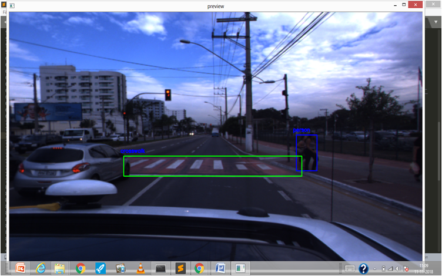

# Detect-Persons-and-Zebra-Crossing-in-Real-time-video-feed-from-Vehicles

Getting an optimal model for training through transfer learning so as to get the real time classification of persons and crosswalk in a low specifications devices , such as smart phone. 
Please Download the model from the following link and place it in graph folder  
https://drive.google.com/file/d/1Wu7vyNoN4_Op-829kMTY7S1qvZX0Y2YO/view?usp=sharing

